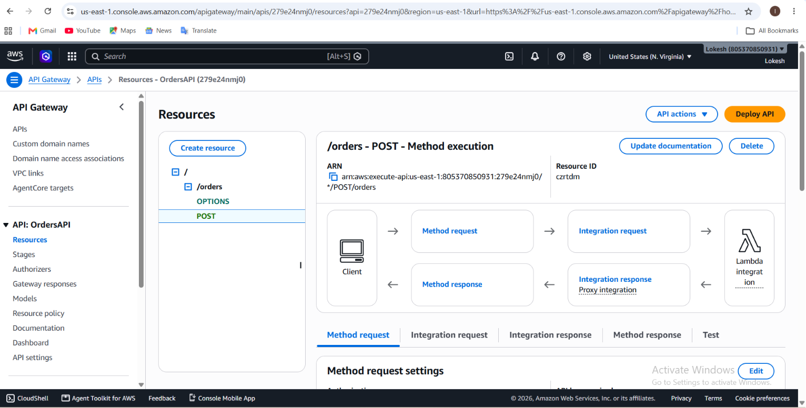
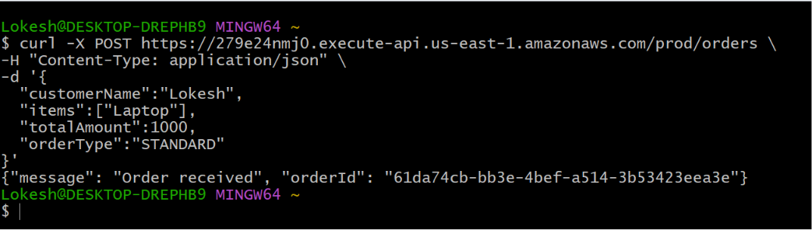
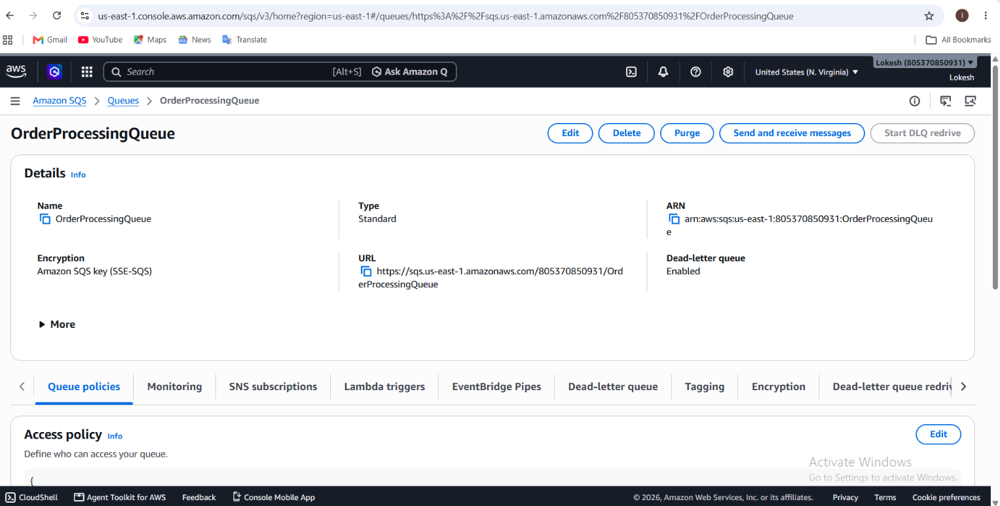
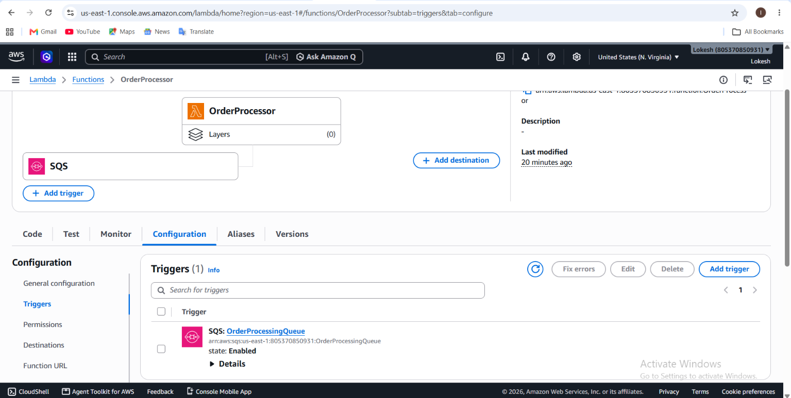
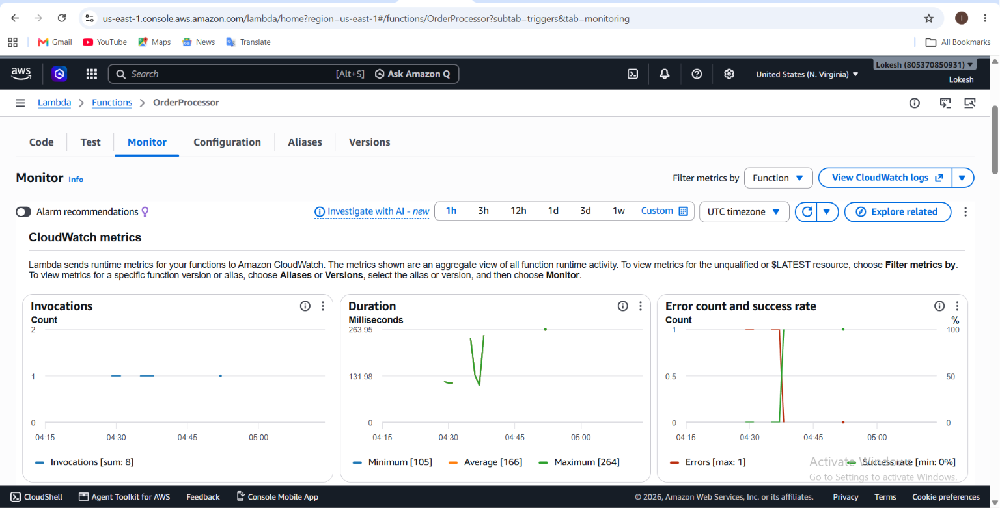
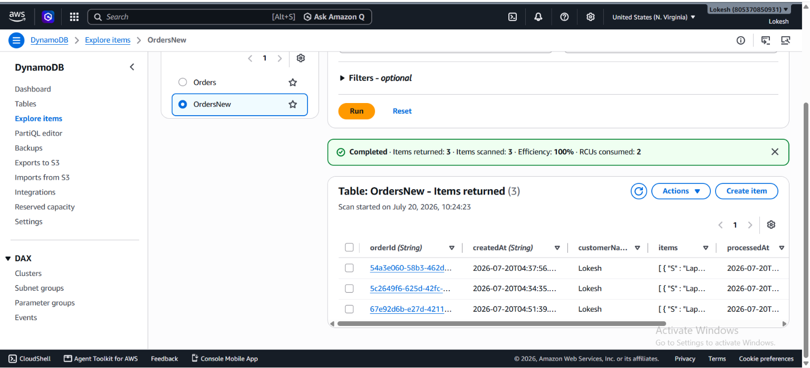
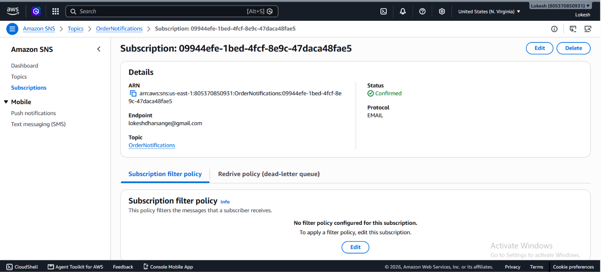
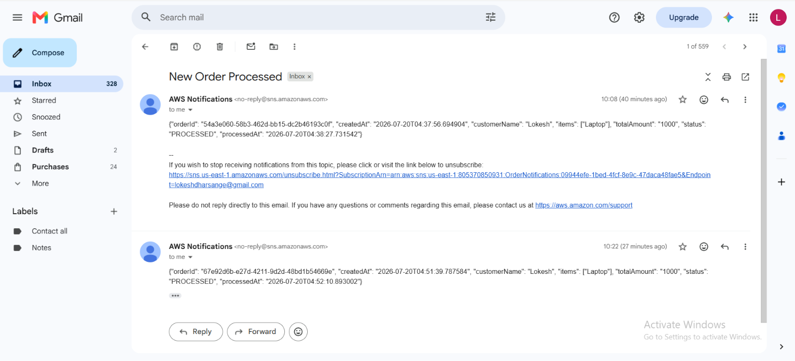
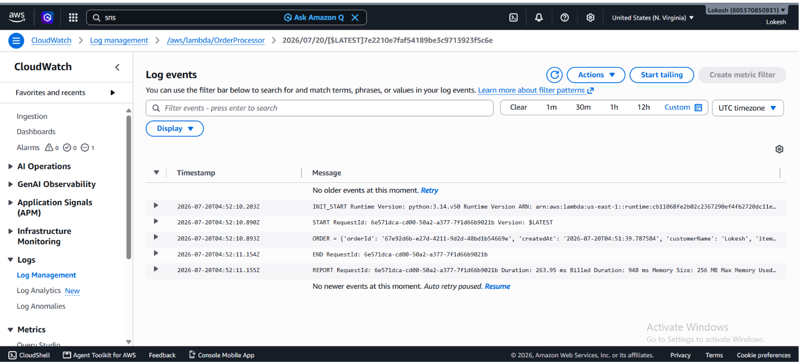

# 🚀 AWS Serverless Order Processing System

A serverless order processing application built on AWS using API Gateway, AWS Lambda, Amazon SQS, Amazon DynamoDB, Amazon SNS, and Amazon CloudWatch.

The application receives customer orders through a REST API, processes them asynchronously using SQS, stores order details in DynamoDB, and sends email notifications via SNS.

---

# 📌 Architecture

)

---

# 🛠️ AWS Services Used

- Amazon API Gateway
- AWS Lambda
- Amazon SQS
- Amazon DynamoDB
- Amazon SNS
- Amazon CloudWatch
- AWS IAM

---

# 📂 Project Structure

```text
aws-serverless-order-processing/
│
├── README.md
│
├── architecture/
│   └── architecture.png
│
├── order-receiver/
│   └── lambda_function.py
│
├── order-processor/
│   └── lambda_function.py
│
└── screenshots/
    ├── api-gateway.png
    ├── api-test.png
    ├── cloudwatch-logs.png
    ├── dynamodb.png
    ├── email-notification.png
    ├── lambda-monitor.png
    ├── orderprocessor-trigger.png
    ├── sns-subscription.png
    └── sqs-queue.png
```

---

# 🚀 Project Workflow

1. Client sends a POST request to API Gateway.
2. API Gateway invokes the Order Receiver Lambda.
3. Order Receiver Lambda validates the request.
4. Order details are sent to Amazon SQS.
5. SQS triggers the Order Processor Lambda.
6. Order Processor stores the order in DynamoDB.
7. SNS sends an email notification.
8. CloudWatch stores logs and metrics.

---

# 🔄 Architecture Flow

```
Client
   │
   ▼
API Gateway
   │
   ▼
Order Receiver Lambda
   │
   ▼
Amazon SQS
   │
   ▼
Order Processor Lambda
   │
   ├────────► DynamoDB
   │
   └────────► Amazon SNS
                    │
                    ▼
              Email Notification
```

---

# 📦 API Endpoint

```
POST /orders
```

Example Request

```json
{
  "customerName": "Lokesh",
  "items": [
    "Laptop"
  ],
  "totalAmount": 1000,
  "orderType": "STANDARD"
}
```

Example Response

```json
{
  "message": "Order received",
  "orderId": "xxxxxxxx-xxxx-xxxx-xxxx-xxxxxxxxxxxx"
}
```

---

# 🧪 API Testing

```bash
curl -X POST https://279e24nmj0.execute-api.us-east-1.amazonaws.com/prod/orders \
-H "Content-Type: application/json" \
-d '{
  "customerName":"Lokesh",
  "items":["Laptop"],
  "totalAmount":1000,
  "orderType":"STANDARD"
}'
```

---

# 📸 Screenshots

## API Gateway



---

## API Testing



---

## Amazon SQS



---

## Lambda Trigger



---

## Lambda Monitor



---

## DynamoDB



---

## SNS Subscription



---

## Email Notification



---

## CloudWatch Logs



---

# ✨ Features

- REST API using API Gateway
- Event-driven serverless architecture
- Asynchronous processing using Amazon SQS
- Automatic Lambda invocation
- Order storage in DynamoDB
- Email notifications using Amazon SNS
- CloudWatch logging and monitoring
- Fully serverless and scalable

---

# 🔮 Future Enhancements

- Dead Letter Queue (DLQ)
- AWS X-Ray Integration
- Amazon Cognito Authentication
- Terraform Deployment
- Order Status Tracking API

---

# 💻 Technologies Used

- Python 3.14
- AWS Lambda
- API Gateway
- Amazon SQS
- Amazon DynamoDB
- Amazon SNS
- Amazon CloudWatch
- Boto3

---

# 👨‍💻 Author

**Lokesh Dharasange**

AWS & DevOps Enthusiast

GitHub:
https://github.com/lokesh-dharasange

LinkedIn:
https://linkedin.com/in/lokesh-dharasange-171279357

---

⭐ If you found this project useful, please consider giving it a Star.
